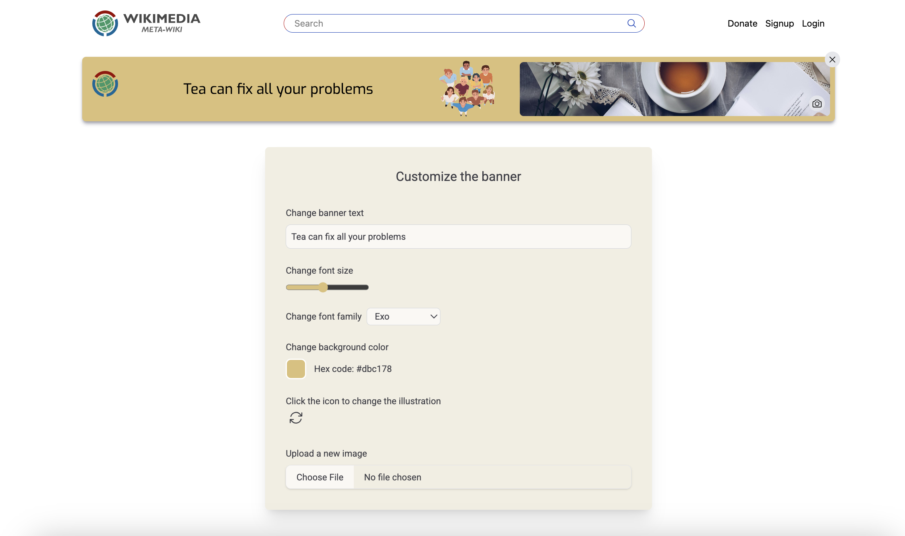

# MediaWiki banners - Outreachy project #1

[Live Demo](https://wikimedia-banner-project.vercel.app)

This project is part of a larger initiative to simplify the creation and customization of MediaWiki banners.
In the current phase, the project focuses on creating a simple web page that allows easy modifications to the banner in real time.

> The goal was to create a straightforward solution for customizing banners. I incorporated a similar nav bar to wikimedia so we can better visualize the banner in the context of the website.



### Libraries and Frameworks used for the project:

-  Vitest as testing framework

-  ReactJS for frontend

- 
  Tailwind for css styling
- 
  React colorful for color picker functionality

### Project consists of two main elements:

1. Full width banner
2. Form to modify the banner elements

### Usage

The following functionalities are available through form controls:

- **Change banner text:** Modify the banner text using the first input field in the form.

- **Change font size:** Change the font size of banner text using the input range slider.

- **Change font family:** Change the font family of banner text using the dropdown menu.

- **Change background color:** The second form element allows changing the background color. It also shows the hex code for the selected color.

- **Change illustration:** Third input field contains an icon that allows us to flip through some illustrations. [ I added a few illustrations in the local memory for now]

- **Upload a new image:** Fourth input also contains an icon and it allows users to upload a new photo to replace the current banner image. I also added this functionality on the banner with the same camera icon for UI consistency.

### Default Banner

By default the banner contains:

- Placeholder text
- A background color
- An illustration
- Banner image

All of these elements can be modified using the form controls.
The page is accessibile for keyboard users and voiceover users.

The page is fully responsive including the navbar, form, images, icons, fonts, and the banner height.

### Project proposition 🎨

Currently the project uses pre-existing illustrations from different artists due to time constraints. However, I am great at making vector illustrations and would be happy to create custom illustrations if needed for the larger project.

### Setup and Installation

1. **Clone the repository**

```bash
git clone https://github.com/harneetsahi/wikimedia-bannerProject.git
```

2. **Install dependencies**

```
npm install
```

3. **Run the development server**

```
npm run dev
```

4. **Run tests**

```
npm run test
```

---
